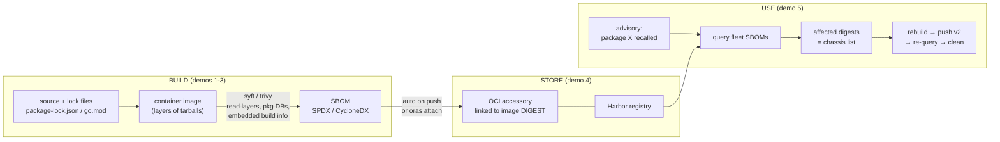

# SBOMs in the Wild: How Open Source Projects Build, Store, and Use Them

**Event:** Let's Talk Open Source Security — OpenSSF community event, Bengaluru Tech Week
**When:** Sept 1–6, 2026, Bengaluru
**Hosts:** Ram Iyengar (OpenSSF), Vandana Verma (Snyk)
**Event page:** https://luma.com/pn41vece
**Speaker:** Prasanth Baskar (Harbor maintainer)

## Talk in one line

Top-down, interactive: start from a bill of materials everyone trusts (Dolo 650, Maruti car recalls), land on software needing the same — what an SBOM is, how Trivy builds one under the hood, where Harbor stores it, and how you "recall" vulnerable software the way Maruti recalls cars.

## Layout

```
PLAN.md      # full interactive agenda (questions + flow)
demos/       # independent terminal demos, one dir each, self-contained
assets/      # screenshots, images, diagrams captured from demos
slides/      # final slides (built separately, after demos are solid)
```

## The pipeline the demos walk through



## Registries (fleet lives on all three)

| registry | native SBOM gen | notes |
|---|---|---|
| `8gcr.container-registry.dev` (kumar) | ✅ works — **use for the talk** | `sbom.harbor` accessory auto on push |
| `bootc.8gears.container-registry.dev` (admin) | ❌ adapter→core 500 | oras-attached SBOMs work |
| `demo.goharbor.io` (kumar) | ❌ PostScan auth misconfig | oras-attached SBOMs work; resets periodically |

## Demos (independent, each runnable on its own)

| # | Demo | Punchline |
|---|------|-----------|
| 1 | [go-binary-buildinfo](demos/01-go-binary-buildinfo/) | A stripped Go binary confesses its full dependency tree |
| 2 | [trivy-vs-syft](demos/02-trivy-vs-syft/) | Same image, two scanners, different component counts — SBOM quality varies |
| 3 | [trivy-under-the-hood](demos/03-trivy-under-the-hood/) | How Trivy actually walks layers, package DBs, and lock files |
| 4 | [harbor-sbom](demos/04-harbor-sbom/) | Harbor attaches SBOM as OCI accessory to the image digest |
| 5 | [software-recall](demos/05-software-recall/) | The Maruti chassis-number lookup, but for container images |
