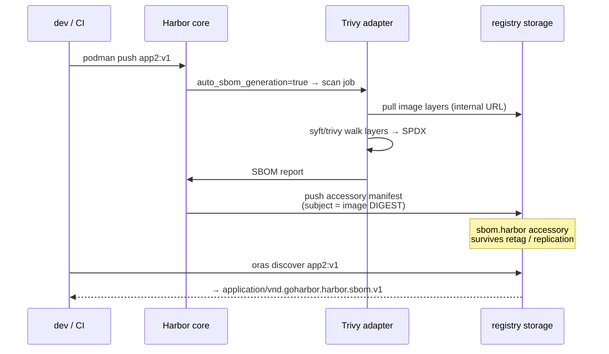

# Demo 4 — Harbor stores the SBOM with the artifact

**Punchline:** SBOMs must travel with the image, not live in a PDF on a shared drive. They attach to the image digest as OCI referrers; Harbor lists them as accessories.

## How it flows



## Environment (live)

**Primary — native flow WORKS here (use for the talk):**
- Harbor: `https://8gcr.container-registry.dev` (2.16.0), project `oss-security-demo` (id 8), kumar/Harbor12345
- `auto_sbom_generation=true`, default scanner Trivy → on every push a `sbom.harbor`
  accessory (SPDX 2.3, ~295 pkgs for app2) appears automatically, digest-linked
- Quirk: `additions/sbom` API rejects these artifacts ("manifest version 2") — fetch
  via oras referrer instead (recall.sh does this)

**Also pushed to (native gen broken, oras-attached SBOMs instead):**
- `bootc.8gears.container-registry.dev` (admin/Harbor12345), project id 7
- `demo.goharbor.io` (kumar/Harbor12345), project id 7410
- Fleet everywhere: `app1..app6` (npm), `goapp` (Go), tag `v1`

## ⚠ Current state of Harbor-native SBOM generation

Auto/manual SBOM scans currently FAIL on this instance: the Grype adapter's embedded
syft gets HTTP 500 pulling images via the internal `http://harbor-bootc-core` URL
(any freshly-pushed image; old bluefin digests "succeed" from the adapter's cache).
The Trivy adapter is registered but dead (null metadata). Fix on the Harbor side:
check `harbor-bootc-grype` + core pod logs. Debug commands:

```bash
H=https://bootc.8gears.container-registry.dev; A='admin:Harbor12345'
curl -sk -u "$A" "$H/api/v2.0/scanners" | jq .
curl -sk -u "$A" "$H/api/v2.0/scanners/<uuid>/metadata" | jq .capabilities
# trigger + read job log
curl -sk -u "$A" -X POST "$H/api/v2.0/projects/oss-security-demo/repositories/app2/artifacts/v1/scan" \
  -H 'Content-Type: application/json' -d '{"scan_type":"sbom"}'
curl -sk -u "$A" "$H/api/v2.0/projects/oss-security-demo/repositories/app2/artifacts/v1?with_sbom_overview=true" | jq .sbom_overview
curl -sk -u "$A" "$H/api/v2.0/projects/oss-security-demo/repositories/app2/artifacts/v1/scan/<report_id>/log"
```

### demo.goharbor.io (fallback registry) — broken differently

Fleet also pushed to `demo.goharbor.io/oss-security-demo` (kumar/Harbor12345,
project 7410, auto_sbom_generation=true, native Trivy adapter). There the Trivy
SBOM scan SUCCEEDS but Harbor's PostScan step fails pushing the accessory: it
resolves the internal registry as `auth.docker.io` → `400 malformed HTTP
Authorization header` (deployment misconfig, job log via same debug commands).

Great talk beat: two Harbor instances, two different native-SBOM failure modes —
"SBOMs in the wild" indeed. The OCI-referrer path below works on both.

Working alternative used below (arguably the better talk content — it's the
vendor-neutral OCI mechanism Harbor itself builds on): generate with syft,
attach with oras.

## Run (what was actually done)

```bash
export PATH=~/.local/bin:$PATH
REG=bootc.8gears.container-registry.dev/oss-security-demo
oras login bootc.8gears.container-registry.dev -u admin -p Harbor12345

# generate SBOM locally, attach to the image as an OCI referrer
syft -q "registry:$REG/app2:v1" -o spdx-json > app2.spdx.json
oras attach --artifact-type application/spdx+json "$REG/app2:v1" app2.spdx.json:application/spdx+json

# the reveal: SBOM is now linked to the DIGEST
oras discover "$REG/app2:v1"
#  └── application/spdx+json
#      └── sha256:6f8de575...

# Harbor sees it as an accessory (also visible in UI, artifact view)
curl -sk -u admin:Harbor12345 \
  "https://bootc.8gears.container-registry.dev/api/v2.0/projects/oss-security-demo/repositories/app2/artifacts/v1/accessories" | jq .
# -> type "subject.accessory", size ~794KB

# fetch the SBOM back out of the registry
D=$(oras discover --format json "$REG/app2:v1" | jq -r '.referrers[0].digest')
B=$(oras manifest fetch "$REG/app2@$D" | jq -r '.layers[0].digest')
oras blob fetch --output - "$REG/app2@$B" | jq '.packages | length'
```

## Talk beats

1. Q21: where does your SBOM go today? (Silence / "S3 bucket somewhere".)
2. `oras attach` → `oras discover` → digest-linked (Q23): retag/replicate, link survives.
3. Harbor UI: accessory sits next to the artifact. When Harbor's scanner is healthy,
   `auto_sbom_generation=true` does all this on every push automatically.
4. Policy angle: Harbor can require SBOM before pull / block on severity.
5. Q24: publishing SBOM ≠ handing attackers a map — they can reverse-engineer anyway.

## Capture for assets/

- [x] `oras discover` tree (see assets/recall-keyv-output.txt for downstream use)
- [ ] Harbor UI artifact + accessory screenshot (manual)
