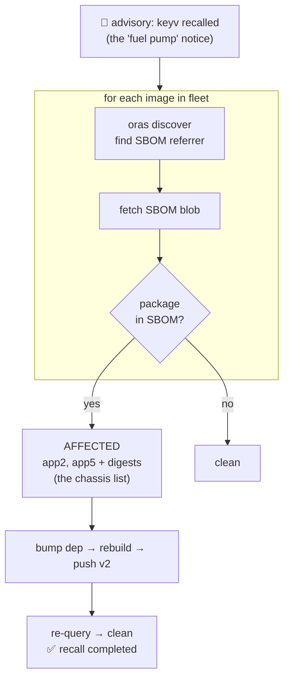

# Demo 5 — The software recall (Maruti chassis lookup, live)

**Punchline:** the closer. 7 images in Harbor, two secretly contain the "recalled" package. Room guesses which; SBOM query answers in seconds. That's the chassis-number lookup for software.

## Fleet (live in Harbor)

`bootc.8gears.container-registry.dev/oss-security-demo/{app1..app6,goapp}:v1`

| image | deps | status |
|---|---|---|
| app1 | express | clean |
| **app2** | express + **keyv@4.5.3** | AFFECTED |
| app3 | fastify | clean |
| app4 | axios | clean |
| **app5** | **keyv@4.5.3** + lodash | AFFECTED |
| app6 | lodash | clean |
| goapp | Go binary (fatih/color) | clean |

`keyv@4.5.3` is a SAFE stand-in for a CHAINDROP/Shai-Hulud-affected version — do
NOT install actually-backdoored versions for the demo. Sources in `images/`,
each has its own SBOM attached as an OCI referrer (see demo 4).

## The recall, visualised



## Run

```bash
export PATH=~/.local/bin:$PATH
# primary: 8gcr — SBOMs are Harbor-native (auto-generated on push)
oras login 8gcr.container-registry.dev -u kumar -p Harbor12345
REG=8gcr.container-registry.dev/oss-security-demo ./recall.sh keyv
# -> assets/recall-keyv-8gcr.txt

# also works against the oras-attached SBOMs on the other two:
REG=bootc.8gears.container-registry.dev/oss-security-demo ./recall.sh keyv   # admin login
REG=demo.goharbor.io/oss-security-demo ./recall.sh keyv                      # kumar login
```

recall.sh matches both SBOM referrer types: `application/spdx+json` (oras-attached)
and `application/vnd.goharbor.harbor.sbom.v1` (Harbor-native).

Actual output (assets/recall-keyv-output.txt):

```
RECALL NOTICE: keyv
Checking fleet of 7 images in bootc.8gears.container-registry.dev/oss-security-demo ...

app1      clean
app2      AFFECTED  keyv@4.5.3  (image sha256:c684ec8aae0a)
app3      clean
app4      clean
app5      AFFECTED  keyv@4.5.3  (image sha256:7266613100cc)
app6      clean
goapp     clean
```

## The fix loop (recall completed)

```bash
cd images/app2
# bump the recalled part
sed -i 's/"keyv": "4.5.3"/"keyv": "^4.5.4"/' package.json
podman build -t bootc.8gears.container-registry.dev/oss-security-demo/app2:v2 .
podman push bootc.8gears.container-registry.dev/oss-security-demo/app2:v2
# new digest -> new SBOM -> attach -> re-query -> clean
syft -q registry:.../app2:v2 -o spdx-json > app2-v2.spdx.json
oras attach --artifact-type application/spdx+json .../app2:v2 app2-v2.spdx.json:application/spdx+json
```

## Talk beats

1. Recap analogy table (chassis number = digest, fuel pump = keyv@x.y.z).
2. Ask room to guess which of the 7 are affected. Take bets.
3. `./recall.sh keyv` → answer in seconds. "This is what Maruti's dealer DB does."
4. Fix app2 live: bump, rebuild, push v2, re-attach SBOM, re-query → clean.
5. Close: "The CHAINDROP question — 'are we affected?' — becomes a 10-second query, not a 2-week fire drill."

## Capture for assets/

- [x] fleet query output → assets/recall-keyv-output.txt
- [ ] before/after fix re-query
- [ ] Harbor UI screenshot of fleet with SBOM accessories
